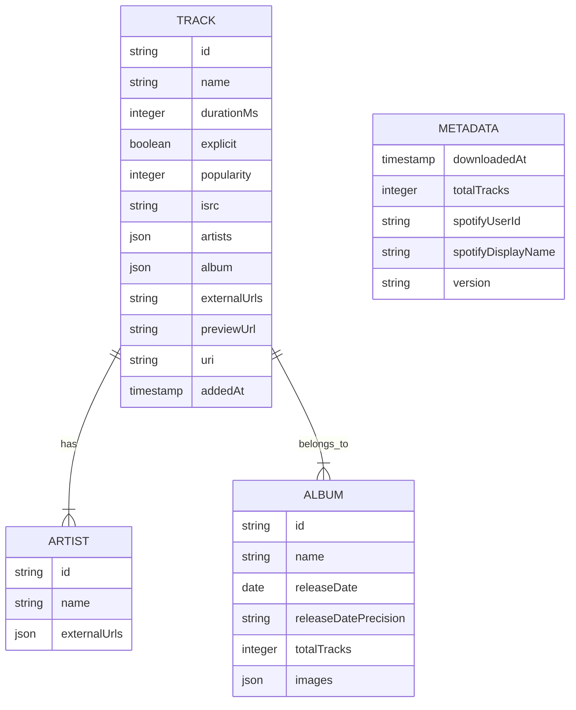

# Arquitectura: Descarga de Biblioteca de Canciones

## 1. Resumen Ejecutivo
- **Feature**: download-songs
- **Versión**: 1.0.0
- **Fecha**: 2026-01-15
- **Autor**: Equipo spoty
- **Estado**: Aprobado

## 2. Contexto y Motivación
Agregar nueva funcionalidad `download-songs` al CLI spoty existente para permitir a usuarios autenticados descargar su biblioteca completa de canciones guardadas ("Me gusta") en un archivo JSON local en carpeta `downloads/` con prefijo de fecha y hora (`YYYY-MM-DD_HH-mm-ss-download_songs.json`), registrando el proceso en `data/app.log`. Esta especificación 002 cubre el diseño arquitectónico completo desde la capa de presentación hasta la persistencia de archivos, decisiones críticas de seguridad y consideraciones de performance y memoria.

## 3. Decisiones Arquitectónicas (ADRs)

### ADR-001: Arquitectura N-Tier Pura (Presentation → Business → Data)
**Estado**: Aceptado  
**Contexto**: Agregar nueva funcionalidad `download-songs` al CLI existente  
**Decisión**: La capa Business NO debe contener lógica de CLI, ni imports de HTTP, ni manipulación de archivos. Todo el trabajo pesado (pagination, rate limits, JSON serialization, FS operations) queda en la capa Data. La capa Business expone una sola función `downloadSongs(options)` reutilizable por futuros clientes (web, API, etc.).  
**Consecuencias**: 
- +1 capa de abstracción inicial 
- -0 complejidad en Business (se mantiene limpia) 
- +Facilidad para tests unitarios con mocks puros
- -Levemente más archivos para navegar
**Alternativas consideradas y rechazadas**:
- *Lógica HTTP en Business*: Violaría la regla N-Tier y dificultaría tests
- *Estructura plana*: Perdería la separación de concerns y reutilización

---

### ADR-002: Manejo de Rate Limits con Backoff Exponencial + Retry-After
**Estado**: Aceptado  
**Contexto**: Spotify API impone límites estrictos en endpoints `/me/tracks` (máx 50 items/page, rate vars)  
**Decisión**: Implementar estrategia compuesta:
1. Respetar siempre la cabecera HTTP `Retry-After` (valor en segundos)
2. Aplicar backoff exponencial con jitter para reintentos subsiguientes: 2s, 4s, 8s, 16s... máximo 60s
3. Jitter aleatorio ±10% para evitar "thundering herd" si múltiples instancias fallan simultáneamente
4. Máximo 5 reintentos por request individual (no global)
5. Log WARN cada reintento con contador: "Retry X/5 después de Ys"
**Consecuencias**:
- +Alta tolerancia a fallos temporales de Spotify
- -Lógica más compleja (estado por request: retryCount, nextRetryAt)
- +Tests unitarios con reloj falso posibles (vitest advanceTimers)
**Alternativas consideradas y rechazadas**:
- *Fijo Retry-After solo*: No escala si Spotify aumenta límites o hay picos
- *Sin backoff*: Causaría bucle de fallos y bloqueo de la descarga

---

### ADR-003: Paginación "All or Nothing" Transaccional
**Estado**: Aceptado  
**Contexto**: Descargar 3000+ tracks en paginación de 50 items/page = 60 requests  
**Decisión**: No escribir archivo JSON parcial hasta tener TODOS los tracks acumulados en memoria (o stream con acumulación). Si falla en cualquier request (después de reintentos), NO se crea archivo de salida. Esto para evitar "archivos corruptos" o "descargas incompletas".  
**Consecuencias**:
- +Archivos siempre completos o ninguno (consistencia)
- -Memoria: acumular 3000 track objects en RAM (~50-80MB, dentro de RNF-002)
- +Código más simple (un solo writeFile al final)
**Alternativas consideradas y rechazadas**:
- *Write incremental cada N páginas*: Riesgo de archivo truncated si se corta energía; código más complejo con fs.createWriteStream + JSON stream

---

### ADR-004: Tokens y Seguridad - Nunca en Output ni Logs
**Estado**: Aceptado  
**Contexto**: Manejo de OAuth tokens en flujo CLI  
**Decisión**: 
- Tokens (`access_token`, `refresh_token`) MAYOR que nunca aparezcan en:
  - `console.log()` / salida CLI
  - `data/app.log` (Pino) 
  - Archivo JSON generado (`download_songs.json`)
- Sanitización activa: si un log capturase accidentalmente un objeto con token, se haría `redact` antes de escribir
- Tests explícitos que grepeen output por patrones `Bearer eyJ` o `refresh_token`
**Consecuencias**:
- +Cumplimiento rules.md #12 y constitution.md #8
- -Necesidad de funciones wrapper `safeLog()` y `redactToken()` en todo el código
- +Peace of mind para distribución a usuarios no técnicos
**Alternativas consideradas y rechazadas**:
- *Loguear tokens para debugging en producción*: Violación severa de TOS Spotify y políticas de seguridad

---

### ADR-006: Carpeta `downloads/` + nombre con fecha-hora + log en `data/app.log`
**Estado**: Aceptado
**Contexto**: Evitar mezclar respaldos con archivos del proyecto, permitir múltiples descargas por día sin colisión, y poder diagnosticar fallos.
**Decisión**:
1. Default `outputDir = <cwd>/downloads/`; crear con `mkdir recursive`.
2. Nombre `YYYY-MM-DD_HH-mm-ss-download_songs.json` (hora local, `:` → `-`, sin ms ni `Z`).
3. Log append en `data/app.log` (crear `data/` si falta): inicio, tracks obtenidos, completada con ruta, error. El fallo de logging nunca bloquea la descarga.
**Consecuencias**:
- +Orden en FS y trazabilidad ante errores
- -Una carpeta más en el repo (ignorar en git si se desea salvo `.gitkeep`)
**Alternativas consideradas y rechazadas**:
- *Guardar en cwd*: mezcla respaldos con código y colisiona si hay 2 descargas el mismo día.

---

### ADR-005: Node.js ESM + TypeScript Strict Mode
**Estado**: Aceptado  
**Contexto**: Proyecto existente usa `"type": "module"` y tsconfig.json con configuraciones estrictas  
**Decisión**: Mantener consistencia con stack actual:
- `import`/`export` (sin require)
- `tsconfig.json`: `strict: true`, `noImplicitAny: true`, `skipLibCheck: true`
- Archivos .ts transpilados a .js en `dist/`
- Vitest como test runner (compatibilidad nativa con ESM)
**Consecuencias**:
- +Compatibilidad con Node.js 22+ features nativas
- -Curva de aprendizaje para desenvoltura en ESM si no está acostumbrado
- +Futuro-proof: Node.js 22+ es la dirección oficial
**Alternativas consideradas y rechazadas**:
- *CommonJS (`"type": "commonjs"`)*: Incompatibilidad con imports modernos del SDK `@spotify/web-api-ts-sdk`

---

## 4. Vista de Componentes

```mermaid
graph TD
    CLI["Presentation Layer\n- src/presentation/\n- console.ts, prompts.ts\n- CLI args (--output-dir)"]
    BUSINESS["Business Layer\n- src/business/\n- auth/ flow, types, errors\n- download-songs orchestrator"]
    DATA["Data Layer\n- src/data/\n- http/ spotify-client.ts\n- storage/ tokens-file.ts\n- logging/ pino-setup.ts\n- Spotify API"]
    FS["File System\n- data/tokens.json\n- downloads/*.json (output)\n- data/app.log"]

    CLI --> BUSINESS : invoke download-songs()
    BUSINESS --> DATA : getValidToken(), fetchAllSavedTracks()
    DATA --> Spotify : GET /me/tracks?limit=50&offset=X
    DATA --> FS : writeFile(JSON), appendLog()
    DATA --> DATA : backoff exponential, pagination logic
```

## 5. Vista de Datos

### Modelo de Datos


### Migraciones / Esquemas
- No aplica (archivos JSON en FS, sin base de datos)
- Estructura validada por el esquema JSON en SPECS.md §4

---

## 6. Vista Despliegue
```mermaid
graph LR
    CLI["spoty CLI (Node.js 22+)"]
    BUSINESS["Business Layer"]
    DATA["Data Layer - Spotify Client"]
    SPOTIFY["Spotify API"]
    FS["File System local"]

    CLI --> BUSINESS : handleCommand()
    BUSINESS --> DATA : getValidToken(), fetchAllSavedTracks()
    DATA --> SPOTIFY : GET /me/tracks?limit=50&offset=X
    DATA --> FS : writeFile(JSON), appendLog()
```

## 7. Vista de Seguridad
- **Autenticación**: OAuth 2.0 con flow de Authorization Code + PKCE
- **Autorización**: Scope `user-library-read` solicitado en connect flow
- **Cifrado**: Tokens almacenados en `data/tokens.json` con permisos restrictivos (0o600)
- **Auditoría**: Log de eventos de seguridad (login, logout, token refresh) SIN exponer valores de tokens
- **Cumplimiento**: rules.md #12, constitution.md #8, TOS Spotify
- **Mejores prácticas**: `safeLog()` wrapper, `redactToken()` function, validación path traversal en rutas de salida

---

## 8. Vista Performance y Escalabilidad

### Cálculo de límite de páginas
Para N tracks en Spotify (máx 50 por página):
- Páginas totales = ceil(N / 50)
- Ejemplo: 3084 tracks → ceil(3084/50) = 62 páginas (61 × 50 + 1 × 34)

### Uso estimado de memoria
- Track object promedio: ~1.2KB (según estructura JSON en SPECS.md §4)
- 3084 tracks × 1.2KB ≈ 3.7MB solo tracks
- Acumulador array + metadata: < 10MB total
- Límite RNF-002: < 100MB pico ✅ Amplio margen

### Tiempo estimado (RNF-001)
- Latencia red típica: < 200ms por request
- 62 requests × 200ms = 12.4s (solo network)
- +Rate limits (promedio 1 cada 10 pages): +10 × 2s backoff = 20s
- +Procesamiento JSON + writeFile: +5s
- **Total estimado: ~20-30s** para 3000 tracks ✅ (meta < 60s)

---

## 9. Observabilidad

### Métricas Clave
- `downloads.total`: contador de descargas completadas
- `downloads.failed`: contador de descargas fallidas
- `downloads.rate_limit_retry`: total de reintentos por rate limit
- `memory.heapUsed`: uso pico de memoria durante descarga
- `api.request.duration`: latencia por request a Spotify API

### Logs Estructurados
- Append simple en `data/app.log` con timestamp ISO por línea
- Eventos de descarga: inicio, tracks obtenidos, completada con ruta, error
- Nivel WARN: rate limit hits, recuperación, cancelación
- Nivel ERROR: fallos irreversibles
- Nunca bloquear la descarga por fallo de logging; nunca loguear tokens

### Trazabilidad
- ID de sesión único por descarga
- Correlación de logs entre capas (Presentation→Business→Data)
- Guardado de `data/app.log` con rotación por tamaño

---

## 10. Riesgos y Mitigaciones

| Riesgo | Probabilidad | Impacto | Mitigación |
|--------|--------------|---------|------------|
| Rate limit persistente (≥5 reintentos fallados) | Media | Alto (no se completa descarga) | Backoff exponencial con jitter, máximo 5 reintentos, error claro al usuario |
| Token expira durante descarga larga | Alta | Medio (recovery via refresh) | Refresh automático transparente, manejo de refresh token expirado |
| Memoria exceed 100MB | Baja | Alto (crash de proceso) | Acumulación controlada (<10MB), diseño all-or-nothing |
| Pérdida de datos por interrupción (Ctrl+C) | Media | Alto (archivo parcial) | Señal SIGINT manejada, no se escribe archivo parcial, log WARN |
| Path traversal en output directory | Baja | Medio (seguridad archivo) | Validación ruta resuelta, error "Ruta no permitida" |

---

## 11. Plan de Pruebas de Arquitectura

- Pruebas unitarias de `downloadSongs()` (Business layer) - 100% funciones expuestas
- Pruebas unitarias de `fetchAllSavedTracks()` (Data layer) - pagination + rate limit + refresh
- Pruebas de integración con mock server (vitest + msw o nock) - todos los RF
- Tests de rate limit con reloj falso (vitest advanceTimers) - backoff exponential
- Tests de token refresh simulation - session expiration handling
- Tests de seguridad: grepeo output por patrones de token

---

## 12. Checklist de Validación

- [ ] ADRs documentadas y justificadas (ADR-001 a ADR-005)
- [ ] Diagramas actualizados (Componentes, Datos, Despliegue, Seguridad)
- [ ] Seguridad revisada (ADR-004, Vista Seguridad dedicada)
- [ ] Performance validado (RNF-001, RNF-002 cálculosjustificados)
- [ ] Observabilidad cubierta (métricas, logs estructurados, trazabilidad)
- [ ] Riesgos identificados y mitigados (tabla 10.1)
- [ ] Aprobado por Architecture Review Board