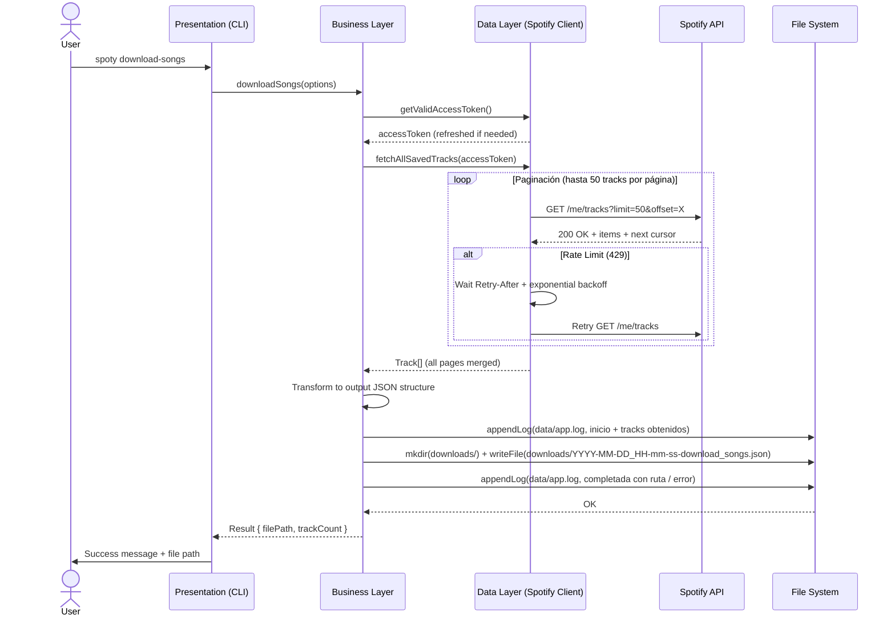

- **Feature**: download-songs
- **Versión**: 1.0.0
- **Autor**: Equipo spoty
- **Fecha**: 2026-01-15
- **Estado**: Aprobado

## 1. Objetivo
Permitir al usuario autenticado descargar el listado completo de sus canciones guardadas (biblioteca personal "Me gusta" / Saved Tracks) en un archivo JSON local con nombre que incluña la fecha y hora de descarga como prefijo (formato: `aaaa-mm-dd_hh-mm-ss-download_songs.json`).

## 2. Alcance

### Incluye:
- Descarga paginada de todas las canciones guardadas del usuario (`/me/tracks` endpoint)
- Serialización a JSON con estructura definida (ver sección 4)
- Nombre de archivo con prefijo de fecha y hora (formato `YYYY-MM-DD_HH-mm-ss`, ej: `2026-10-06_14-30-45-download_songs.json`)
- Guardado en carpeta `downloads/` por defecto (configurable vía `outputDir` / `--output-dir`, con creación recursiva si no existe)
- Manejo de rate limits (HTTP 429) con backoff exponencial y respeto a `Retry-After`
- Reutilización de la sesión OAuth existente (tokens guardados)
- Refresh automático de token si ha expirado durante la descarga
- Registro del proceso en `data/app.log` (append): inicio de descarga, tracks obtenidos, descarga completada con ruta, y errores durante el procesamiento (sin tokens)
- Mensajes de usuario en español claros y accionables

### No incluye:
- Descarga de archivos de audio (solo metadatos)
- Descarga de playlists (solo biblioteca personal "Saved Tracks")
- Sincronización bidireccional o modificación de la biblioteca
- Interfaz gráfica (solo CLI)
- Filtrado avanzado durante la descarga (se descarga todo)

## 3. Reglas de Negocio (RB)

| ID | Regla | Referencia |
|----|-------|------------|
| RB-001 | Scope `user-library-read` debe estar presente en token | UC-001 FA-001 / RB-001 |
| RB-002 | Máximo 50 tracks por request (límite API Spotify) | UC-001 / RF-001 |
| RB-003 | Fecha y hora en nombre de archivo = fecha/hora inicio descarga (formato `aaaa-mm-dd_hh-mm-ss`) | UC-001 FA-001 / RF-002 |
| RB-004 | `addedAt` preservado tal cual de API (ISO 8601 UTC) | SPECS §4 / AC-013 |
| RB-005 | Respetar `Retry-After` siempre (no asumir valor fijo) | ADR-002 / RF-004 |
| RB-006 | Backoff exponencial con jitter (±10%) para evitar thundering herd | ADR-002 / RF-004 |
| RB-007 | Contador de reintentos por request individual (no global) | UC-002 / AC-005 |
| RB-008 | Refresh automático transparente al usuario (sin prompt) | UC-003 |
| RB-009 | Nuevo refresh_token (si viene) debe persistirse | UC-003 |
| RB-010 | Tracks ya descargados en memoria se conservan durante refresh | UC-003 |
| RB-011 | La opción 3 solo está disponible después de conectar (tener tokens) | UC-006 |
| RB-012 | El flujo por menú interactivo es idéntico al flujo por comando | UC-006 |
| RB-013 | Después de completar, el menú vuelve a mostrarse para nuevas operaciones | UC-006 |
| RB-014 | La opción 0 sale de la aplicación | SPECS §3.1 |
| RB-015 | Archivos con permisos restrictivos (0o600) | SPECS §6 |
| RB-016 | No hay tokens en logs, consola ni archivo de salida | ADR-004 / RNF-003 |
| RB-017 | Archivo se guarda en `downloads/` por defecto; `outputDir` lo sobrescribe | UC-001 / RF-011 |
| RB-018 | Cada descarga registra en `data/app.log`: inicio, tracks obtenidos, completada/error | UC-001 / RNF-006 |

## 3. Actores y Contexto
- **Usuario final**: Usuario autenticado en spoty que quiere respaldar su biblioteca musical
- **Sistema**: CLI spoty que gestiona autenticación, llama a Spotify API, procesa paginación y guarda JSON
- **Interfaz de línea de comandos**: Ejecución mediante comandos `spoty download-songs` o opción 3 en modo interactivo

## 3.1 Interfaz de Línea de Comandos (CLI)
- `spoty download-songs`: Ejecuta la descarga directa de la biblioteca guardada
- `spoty` (modo interactivo): Muestra menú principal con opciones:
  - Opción 1: Conectar con Spotify
  - Opción 2: Ver estado de conexión
  - Opción 3: Descargar biblioteca
  - Opción 4: (placeholder)
  - Opción 5: (placeholder)
  - Opción 6: (placeholder)
  - Opción 7: (placeholder)
  - Opción 8: (placeholder)
  - **Opción 9: Cerrar sesión** (movida de 5 a 9)
  - **Opción 0: Salir** (nueva, sale de la aplicación)

## 4. Modelo de Datos - Estructura del JSON de Salida

```json
{
  "metadata": {
    "downloadedAt": "2026-01-15T14:30:45.123Z",
    "totalTracks": 3084,
    "spotifyUserId": "abc123def456",
    "spotifyDisplayName": "Juan Pérez",
    "version": "1.0"
  },
  "tracks": [
    {
      "addedAt": "2025-06-15T10:23:12.000Z",
      "track": {
        "id": "4iV5W9uYEdYUVa79Axb7Rh",
        "name": "Bohemian Rhapsody",
        "durationMs": 354000,
        "explicit": false,
        "popularity": 85,
        "isrc": "GBUM71001338",
        "artists": [
          {
            "id": "1dfeR4HaWDbWqFHLkxsg1d",
            "name": "Queen",
            "externalUrls": { "spotify": "https://open.spotify.com/artist/1dfeR4HaWDbWqFHLkxsg1d" }
          }
        ],
        "album": {
          "id": "3y8A2Yh3ltQ8YjXrKZHQZ5",
          "name": "A Night at the Opera",
          "releaseDate": "1975-11-21",
          "releaseDatePrecision": "day",
          "totalTracks": 12,
          "images": [
            { "url": "https://i.scdn.co/image/ab67616d0000b273...", "height": 640, "width": 640 },
            { "url": "https://i.scdn.co/image/ab67616d00001e02...", "height": 300, "width": 300 },
            { "url": "https://i.scdn.co/image/ab67616d00004851...", "height": 64, "width": 64 }
          ],
          "externalUrls": { "spotify": "https://open.spotify.com/album/3y8A2Yh3ltQ8YjXrKZHQZ5" }
        },
        "externalUrls": { "spotify": "https://open.spotify.com/track/4iV5W9uYEdYUVa79Axb7Rh" },
        "previewUrl": "https://p.scdn.co/mp3-preview/...",
        "type": "track",
        "uri": "spotify:track:4iV5W9uYEdYUVa79Axb7Rh"
      }
    }
  ]
}
```

**Notas**:
- `addedAt`: Fecha en que el usuario guardó la canción en su biblioteca (del wrapper `SavedTrackObject`)
- `track`: Objeto `TrackObject` completo según Spotify Web API
- La paginación de Spotify devuelve máximo 50 items por request (default 20)

## 5. Endpoints Spotify API Requeridos

| Endpoint | Método | Scope Requerido | Descripción |
|----------|--------|-----------------|-------------|
| `/me/tracks` | GET | `user-library-read` | Obtener tracks guardados (paginado, max 50 por página) |
| `/me` | GET | `user-read-email` | Obtener perfil del usuario autenticado (userId, displayName) |

**Parámetros de query**:
- `limit`: 1-50 (usaremos 50 para minimizar requests)
- `offset`: Para paginación
- `market`: Opcional (ISO 3166-1 alpha-2), usaremos `from_token`

## 6. Restricciones Técnicas

- **Node.js**: v22+ (ESM, TypeScript)
- **Arquitectura N-Tier**: Presentation → Business → Data (sin lógica HTTP en Business)
- **Rate Limits**: Backoff exponencial (base 1s, max 60s), respetar `Retry-After`
- **Persistencia**: Archivo JSON en carpeta `downloads/` local (no base de datos); crear carpeta con `mkdir recursive`
- **Tokens**: Reutilizar `data/tokens.json` existente, refresh automático
- **Logs**: Append en `data/app.log` (inicio / tracks obtenidos / completada con ruta / error); crear carpeta `data/` si no existe
- **Permisos FS**: Archivos con permisos restrictivos (0o600)

## 7. Flujo de Secuencia (Mermaid)



## 8. Consideraciones de Seguridad

- Tokens OAuth nunca en logs ni en archivo de salida
- Archivo JSON de salida solo contiene metadatos públicos de tracks
- Validación de ruta de salida para path traversal
- Sanitización de nombre de archivo

## 9. Checklist de Validación

- [ ] Especificación completa
- [ ] Interfaces definidas
- [ ] Modelos validados
- [ ] Reglas de negocio documentadas
- [ ] Endpoints TypeScript definidos
- [ ] Códigos de salida validados
- [ ] Diagramas Mermaid en sintaxis compatible

## 9. Fuera de Alcance (Future Enhancements)
- Descarga incremental (solo tracks nuevos desde última descarga)
- Export a otros formatos (CSV, Excel)
- Descarga de playlists específicas
- Filtrado por artista, álbum, fecha
- Compresión del archivo de salida