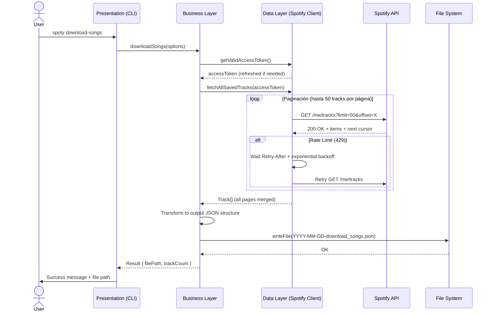

# Especificación: Descarga de Biblioteca de Canciones de Spotify

## 1. Objetivo
Permitir al usuario autenticado descargar el listado completo de sus canciones guardadas (biblioteca personal "Me gusta" / Saved Tracks) en un archivo JSON local con nombre que incluya la fecha de descarga como prefijo (formato: `aaaa-mm-dd-download_songs.json`).

## 2. Alcance

### Incluye:
- Descarga paginada de todas las canciones guardadas del usuario (`/me/tracks` endpoint)
- Serialización a JSON con estructura definida (ver sección 4)
- Nombre de archivo con prefijo de fecha ISO 8601 (YYYY-MM-DD)
- Guardado en directorio configurable (por defecto: directorio de trabajo actual)
- Manejo de rate limits (HTTP 429) con backoff exponencial y respeto a `Retry-After`
- Reutilización de la sesión OAuth existente (tokens guardados)
- Refresh automático de token si ha expirado durante la descarga
- Log de progreso y errores en `data/app.log` (Pino)
- Mensajes de usuario en español claros y accionables

### No incluye:
- Descarga de archivos de audio (solo metadatos)
- Descarga de playlists (solo biblioteca personal "Saved Tracks")
- Sincronización bidireccional o modificación de la biblioteca
- Interfaz gráfica (solo CLI)
- Filtrado avanzado durante la descarga (se descarga todo)

## 3. Actores y Contexto
- **Usuario final**: Usuario autenticado en spoty que quiere respaldar su biblioteca musical
- **Sistema**: CLI spoty que gestiona autenticación, llama a Spotify API, procesa paginación y guarda JSON

## 4. Modelo de Datos - Estructura del JSON de Salida

```json
{
  "metadata": {
    "downloadedAt": "2026-01-15T14:30:45.123Z",
    "totalTracks": 3084,
    "spotifyUserId": "abc123def456",
    "spotifyDisplayName": "Juan Pérez",
    "version": "1.0"
  },
  "tracks": [
    {
      "addedAt": "2025-06-15T10:23:12.000Z",
      "track": {
        "id": "4iV5W9uYEdYUVa79Axb7Rh",
        "name": "Bohemian Rhapsody",
        "durationMs": 354000,
        "explicit": false,
        "popularity": 85,
        "isrc": "GBUM71001338",
        "artists": [
          {
            "id": "1dfeR4HaWDbWqFHLkxsg1d",
            "name": "Queen",
            "externalUrls": { "spotify": "https://open.spotify.com/artist/1dfeR4HaWDbWqFHLkxsg1d" }
          }
        ],
        "album": {
          "id": "3y8A2Yh3ltQ8YjXrKZHQZ5",
          "name": "A Night at the Opera",
          "releaseDate": "1975-11-21",
          "releaseDatePrecision": "day",
          "totalTracks": 12,
          "images": [
            { "url": "https://i.scdn.co/image/ab67616d0000b273...", "height": 640, "width": 640 },
            { "url": "https://i.scdn.co/image/ab67616d00001e02...", "height": 300, "width": 300 },
            { "url": "https://i.scdn.co/image/ab67616d00004851...", "height": 64, "width": 64 }
          ],
          "externalUrls": { "spotify": "https://open.spotify.com/album/3y8A2Yh3ltQ8YjXrKZHQZ5" }
        },
        "externalUrls": { "spotify": "https://open.spotify.com/track/4iV5W9uYEdYUVa79Axb7Rh" },
        "previewUrl": "https://p.scdn.co/mp3-preview/...",
        "type": "track",
        "uri": "spotify:track:4iV5W9uYEdYUVa79Axb7Rh"
      }
    }
  ]
}
```

**Notas**:
- `addedAt`: Fecha en que el usuario guardó la canción en su biblioteca (del wrapper `SavedTrackObject`)
- `track`: Objeto `TrackObject` completo según Spotify Web API
- La paginación de Spotify devuelve máximo 50 items por request (default 20)

## 5. Endpoints Spotify API Requeridos

| Endpoint | Método | Scope Requerido | Descripción |
|----------|--------|-----------------|-------------|
| `/me/tracks` | GET | `user-library-read` | Obtener tracks guardados (paginado, max 50 por página) |

**Parámetros de query**:
- `limit`: 1-50 (usaremos 50 para minimizar requests)
- `offset`: Para paginación
- `market`: Opcional (ISO 3166-1 alpha-2), usaremos `from_token`

## 6. Restricciones Técnicas

- **Node.js**: v22+ (ESM, TypeScript)
- **Arquitectura N-Tier**: Presentation → Business → Data (sin lógica HTTP en Business)
- **Rate Limits**: Backoff exponencial (base 1s, max 60s), respetar `Retry-After`
- **Persistencia**: Archivo JSON en FS local (no base de datos)
- **Tokens**: Reutilizar `data/tokens.json` existente, refresh automático
- **Logs**: Pino en `data/app.log` (INFO para progreso, ERROR para fallos)
- **Permisos FS**: Archivos con permisos restrictivos (0o600)

## 7. Flujo de Secuencia (Mermaid)



## 8. Consideraciones de Seguridad

- Tokens OAuth nunca en logs ni en archivo de salida
- Archivo JSON de salida solo contiene metadatos públicos de tracks
- Validación de ruta de salida para path traversal
- Sanitización de nombre de archivo

## 9. Fuera de Alcance (Future Enhancements)
- Descarga incremental (solo tracks nuevos desde última descarga)
- Export a otros formatos (CSV, Excel)
- Descarga de playlists específicas
- Filtrado por artista, álbum, fecha
- Compresión del archivo de salida